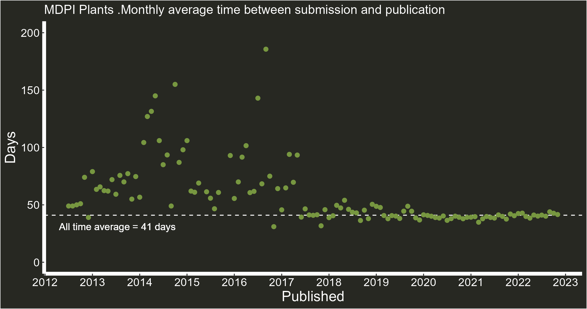
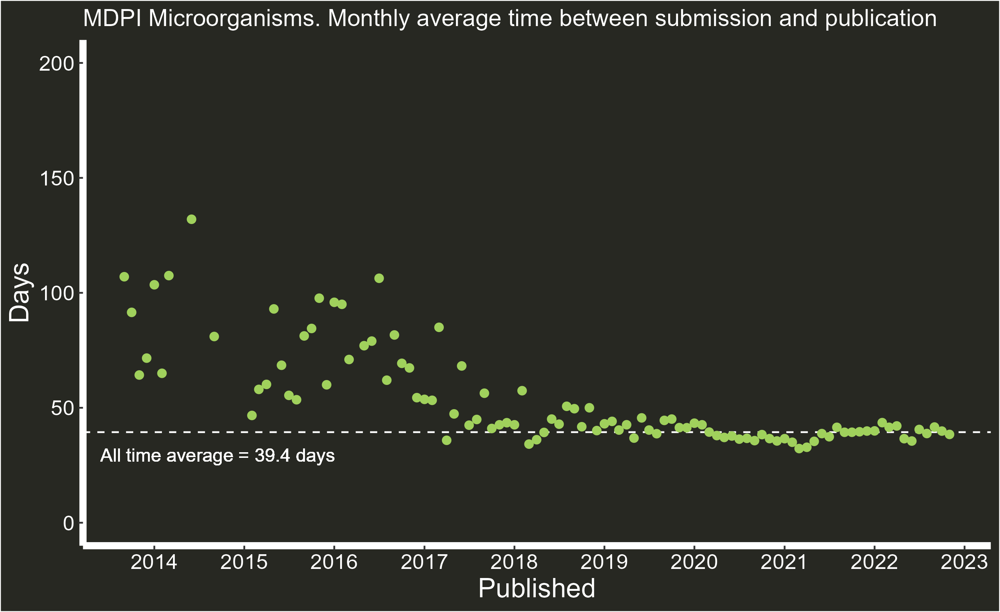
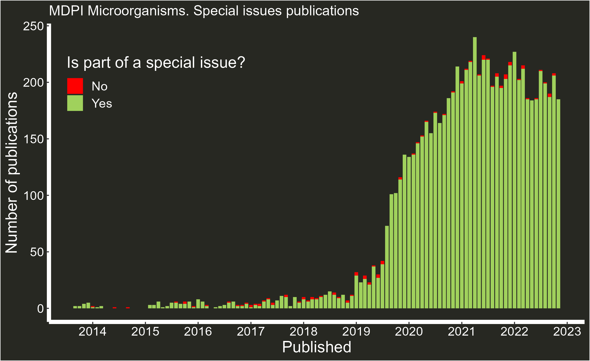

# Web scrapping MDPI publications with R {.unnumbered}

Inspired by 2021 [Paolo Crosetto](https://twitter.com/PaoloCrosetto)'s blog ([Is MDPI a predatory publisher?](https://paolocrosetto.wordpress.com/2021/04/12/is-mdpi-a-predatory-publisher/)), I wanted to have a look at some MDPI journal metrics using web scraping tools ([rvest](https://rvest.tidyverse.org/)) via R, presenting factual data without judging if they are or not of predatory nature (I'll leave that to the reader), enabling others to use the same code to explore metrics from other MDPI journals. The code and some journal data sets are available [here (GitHub link)](https://github.com/pgomba/MDPI_explorer). Originally, data and code were shared via Twitter, and you can follow the original discussion [here (Twitter link)](https://twitter.com/pagomba/status/1597157180394074115?s=20&t=12SZ_JLeZkUK0WGF6lmM3A).

## The code {.unnumbered}

The first step is to download the links from the journal web sitemap (thanks to twitter user [\@JorritGosens](https://twitter.com/JorritGosens) for helping make this part easier than I had planned). To do so, select a journal (use non-capital letters) and proceed to read the page and extract all the links available

```

library(tidyverse)
library(rvest)

journal<-"sustainability"

sitemap<-read_html(paste0("https://www.mdpi.com/sitemap/sitemap.",journal,".xml"))

papers<-sitemap%>%
  html_nodes("loc")%>%
  html_text2()

```

These links contain more than the papers we are looking for. Using some keywords we can get rid of those links we are not interested on (announcements, news, blogs, etc). Keep in mind that a sitemap can't contain more than 50,000 links, and therefore, if the journal has more than 50,000 papers these will continue in a different web sitemap. But, 50.000 is enough for what we plan to do here.

```

cleaner<- "guide|even|topi|soci|subm|conf|section|issue|about|announcements|awa|indexing|instructions|apc|history|detailed_instructions|edit|imprint|toc-alert|stats|most_cited"

clean_papers<-papers[-grep(cleaner, papers)]
```

And that's it. With some minor exceptions, `clean_papers` is now a list with url links to the papers.

I'm going to focus now in extracting information from these papers, targeting editorial data (submission, revision, acceptance and publication time) along with whether or not they are part of a special issue. With a loop, I make [rvest](https://rvest.tidyverse.org/) go, paper by paper, extracting this information, appending it to `pubhistory` (a list). Requesting a high number of papers in little time might end up with MDPI kicking you out of their servers. The function `Sys.sleep(1)` its there to slow down the speed of the loop by stopping 1 second everytime the loop starts again. I've had some success reducing this number on journals with less than 8,000 publications, and I think it needs further increase to tackle journals over 50,000 publications (working on it atm). This is because when MDPI detects a high volume of requests, the server kicks you out. If you have this problem, consider breaking `clean_papers` into smaller lists, and pass them one by one.

```

pubhistory<-list() 

for (i in clean_papers) {
  Sys.sleep(1)
  paper<-read_html(i)
  ex_paper<-paper%>%
    html_nodes(".pubhistory")%>%
    html_text2()
  ex_paper2<-paper%>%
    html_nodes(".belongsTo")%>%
    html_text2()
  w<-paste(i,"-",ex_paper,"-",ex_paper2)
  pubhistory<-append(w,pubhistory)
}
```

The final step is to compile the table. You will notice some papers don't have revision time. This might be because they were accepted straight away (no revisions needed). I have removed these from the final table (`drop_na()`) for simplicity in the analysis, but if you want to have all publications, remove the `drop_na()`.

```

pub_table<-do.call(rbind, pubhistory)%>%
  as_tibble()%>%
  separate(V1,sep=" - ",c("link","Publication","Special_issue"))%>%
  separate(Publication,sep="/",c("Received","Revised","Accepted","Published"))%>%
  drop_na()%>% #remove papers accepted straight away
  mutate(Received= gsub("Received: ","",Received))%>%
  mutate(Received= lubridate::dmy(gsub(" ","/",Received)))%>%
  mutate(Revised=gsub("Revised: ","",Revised))%>%
  mutate(Revised= lubridate::dmy(gsub(" ","/",Revised)))%>%
  mutate(Accepted=gsub("Accepted: ","",Accepted))%>%
  mutate(Accepted= lubridate::dmy(gsub(" ","/",Accepted)))%>%
  mutate(Published=gsub("Published: ","",Published))%>%
  mutate(Published= lubridate::dmy(gsub(" ","/",Published)))%>%
  mutate(days=Published-Received)%>%
  mutate(is_s_issue=if_else(Special_issue=="","No","Yes"))
```

## Graphs {.unnumbered}

The code for the graphs below is available in the GitHub repository linked at the beginning, and are just an example of what can be done with the data, but much more can be done (most published author, countries and institutions with more publications, abstract wordclouds, etc).

Some key aspects to note are the reduction and homogenization of publication times, the increase in publications in recent years and the reliance in special issues. This has been noted before (see [Is MDPI a predatory publisher?](https://paolocrosetto.wordpress.com/2021/04/12/is-mdpi-a-predatory-publisher/) blog).

-   MDPI Plants

    

    

    

-   MDPI Diversity

    

    

    

-   MDPI Microorganisms

    

    

    
